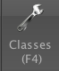

Orbit Image Analysis
====================

Orbit Image Analysis is a free open-source software which can connect to OMERO and work with images stored in OMERO server.

Description:
------------

Orbit Image Analysis is a free open-source software with the focus on quantification of big images like whole slide scans. It offers sophisticated image analysis algorithms. Of those, tissue quantification using machine learning techniques, object/cell segmentation, and object classification are the basic ones. For more details, go to \ http://www.orbit.bio/\ .

We show:

-  How to connect Orbit to OMERO

-  How to open an image using Orbit user interface from OMERO.

-  How to create classes in Orbit, draw ROIs, train, segment and detect objects in Orbit.

-  How to save a “model” of the trained sequence from Orbit to OMERO.

-  How to write a script which

   -  Retrieves the saved model from OMERO to Orbit.

   -  Executes the model on a part of an image.

   -  Does the segmentation and draws ROIs around the segmented objects.

   -  Saves the ROIs on the original image in OMERO.

Setup:
------

Orbit has been installed on the local machine.
See \ http://www.orbit.bio/\  for details.

**Resources:**
--------------

-  Data used \ https://downloads.openmicroscopy.org/images/SVS/

-  Script used \ https://raw.githubusercontent.com/ome/training-scripts/master/practical/orbit/segmentation.groovy

**Step-by-Step:**
-----------------

Manual training:
----------------

#.  Launch Orbit, click *Yes* in the first dialog box:

    .. image:: images/Orbit1.png

#.  Then enter the server details in the next dialog. Only the Host/IP field is essential here and should be set to *<omero-server.address>*. For example, the OMERO server address could be added in the form of *demo.openmicroscopy.org* (Please replace with your own OMERO.server address).

     .. image:: images/Orbit2.png

#.  Then login to OMERO with the credentials provided:

     .. image:: images/Orbit3.png

#.  Orbit will show data from OMERO in the left-hand panel. Click show only my assets to filter by data your own.

#.  Select the group Lab1.

#.  Datasets not within a Project are listed under unassigned:

    .. image:: images/Orbit4.png

#.  Select the svs Dataset. Image thumbnails will be shown in the panel below.

#.  Double-click on the 77928.svs [Series 1] thumbnail or drag and drop it into the centre panel and maximise the viewer window to fill the centre panel.

    .. image:: images/Orbit5.png

#.  The aim is to train a model to recognize cell nuclei and use this for segmentation.

#. Click the Model tab and then the Classes button |image5|\

#. In the dialog, remove the Celltype 1 class by selecting it and click the remove class button.

#. The select the Celltype 2 class, and rename it by typing Foreground in the name field and clicking rename class.

#. You should now have two classes named Background and Foreground:

    .. image:: images/Orbit7.png

#. Click OK to close the dialog.

#. Now construct the model by defining regions of Foreground and Background on the Image.

#. Click the Object Detection tab, select the Polygon tool and choose the Foreground class from the chooser at the top-left of the screen. 

    .. image:: images/Orbit8.png

#. You can now draw around a number of cell nuclei on the Image. The more accurately you draw and the higher number of objects you define, the more you will improve the performance of the segmentation, but about a dozen should be sufficient.

#. Now switch to the Background class and draw around several background regions. 

    .. image:: images/Orbit9.png

#. We can then train the model by clicking the Train button or press F7. You will see a progress bar in the right-hand panel.

    .. image:: images/Orbit10.png 

#. To see how this model classifies objects within a region, click the *Define ROI* button and draw around a region of the image. Then click *Classify*. If no ROI is drawn, Orbit will attempt to classify the whole Image which can be very time-consuming.

    .. image:: images/Orbit11.png

#. Once the classification is complete, a notification window pops up. Close it and view the results on the Image by dragging the slider below the Image to the right: 

    .. image:: images/Orbit12.png

#. To segment the Image using this classification, click Set Primary Segmentation Model and then Object Segmentation. 

    .. image:: images/Orbit13.png
    .. image:: images/Orbit14.png
    .. image:: images/Orbit15.png

#. Click the *Model* tab and *Save Model On Server*, enter a name to save the model to OMERO. Note that you can also use *Save Model as…* to save the model to your local drive.

Scripted segmentation and saving to OMERO
-----------------------------------------

We will use the model created in the last step above to repeat the segmentation, using a script which allows us to save the results back to OMERO. This will use a saved ROI Annotation instead of a temporary ROI as in the manual workflow.

#.  Re-open the same image 77928.svs [Series 1] to clear the ROIs and in the right-hand panel select the Annotations tab.

#.  Pan the Image to a region you wish to analyse, select the *Add Polygon* button and draw around a region.

    .. image:: images/Orbit16.png

#.  Select this Annotation from the list in the right panel and click Edit (pencil icon).

#.  In the dialog, set the *Type* to *ROI*.

    .. image:: images/Orbit17.png

#.  Click Ok. This will save the ROI as an annotation on this image in OMERO.

#.  Click on *Tools > Script Editor* to open a scripting window.

#.  Copy the script from training-scripts: \ https://raw.githubusercontent.com/ome/training-scripts/master/practical/orbit/segmentation.groovy and replace the existing code in the script window.

#.  Update the username and password

#.  The script will load the Orbit model and the ROI that we saved to OMERO, segment the image within the ROI and save the segmented shapes as Polygons to OMERO.

#. Click *Run*.

#. When complete, you can use OMERO.iviewer to see the ROIs created in OMERO.

